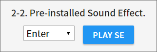

# toio™Core Cube Sound Checker
Version 1.0.0  

[Game Music Sample](https://youtu.be/LnFHprQWCl4) ↓  

# Description
A tool enables us to check sound function of toio™Core Cube by using MIDI audio source and so on.   
See [this article](https://qiita.com/tetunori_lego/items/42f4bad7fdcd7d31d8f6) in detail. You can try [here](https://tetunori.github.io/toioCoreCubeSoundChecker/).  
Now, WebBluetooth works on the limited browser/OS. Please check the support status on [Can I Use](https://caniuse.com/#feat=web-bluetooth).

# Usage
## Preparation
1. Turn the Cubes on. This tool supports up to **3** Cubes.
2. Open [this tool](https://tetunori.github.io/toioCoreCubeSoundChecker/). Google Chrome is highly recommended.
3. Press `Connect Cube N` buttons and select Cube one after another. If Cube connect with PC, LED under Cube will light in Blue, Green and Red respectively.
4. If the tool is ready, some buttons will be enabled.

## Single Note
 - Select a note via slider in the region below. Although the sound will be automatically played, you can also play the current note by pushing `PLAY NOTE` button.
  
 - You can also use left/right cursor keys to select a note.

## Pre-installed Sound Effect(SE)
 - toio™Core Cube has a few pre-installed sound effects in advance.
 - Select a SE item with dropdown in the region below. Although the sound will be automatically played, you can also play the current SE by pushing `PLAY SE` button.
  

## Play from MIDI file
 - Drag&drop a MIDI file into the square below or click it to select a file, then the file will be analyzed and tracks are set in the dropdown next to the string 'Cube N:'. `PLAY` button under the square will be enabled, simultaneously.
  
 - After Selecting a track with the dropdown, push `PLAY` button. Then you can hear the sound from Cubes.
 - **CAUTION**: This tool has a problem with synchronization between Cubes on Windows environment. Moreover, please keep this tool fore-ground on Google Chrome for keeping performance.

## Appendix A. Copy code.
 - All melody codes are shown in this region. Anytime, you can copy by pushing `COPY CODE` button!
  

## Appendix B. Sample sounds.
 - Some sample SE and a molody are prepared in this tool in advance. You can enjoy by just pressing these play buttons.
  

# Licence
This software is released under the MIT License, see LICENSE.  
This software includes a work that is distributed in the Apache License 2.0.

# Author
Tetsunori NAKAYAMA.

# References
Dropify  
https://github.com/JeremyFagis/dropify

Copy to clipboard  
https://qiita.com/simiraaaa/items/2e7478d72f365aa48356

Code prettifier  
https://github.com/google/code-prettify
https://github.com/tetunori/MESH_SDK_Exported_Data_Viewer

Tone.js/MIDI  
https://github.com/Tonejs/Tone.js
https://tonejs.github.io/Midi/

MIDI test data  
created with 'CHROME MUSIC LAB: SONG MAKER'  
https://musiclab.chromeexperiments.com/Song-Maker/

Icon  
https://material.io/resources/icons/

UI parts  
https://www.muicss.com/
